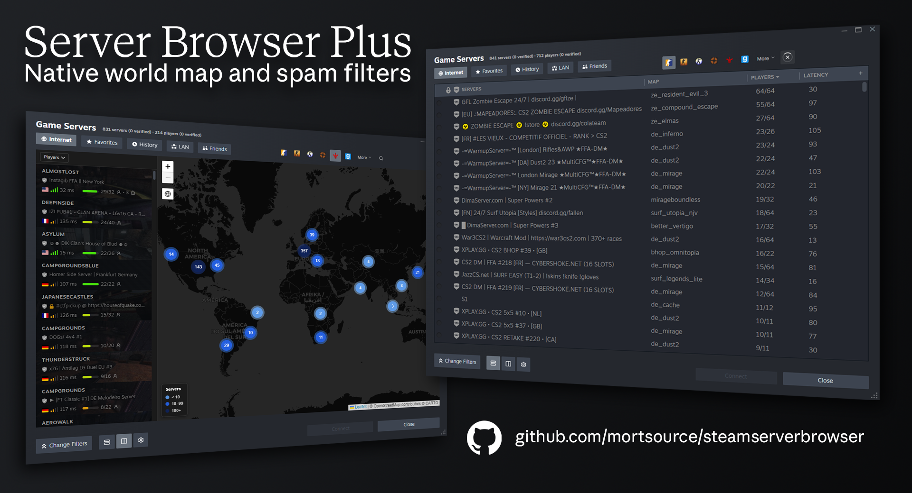

# Server Browser Plus for Steam

<p align="center">
    
    
</p>



## The Problem
Valve has repeatedly ignored issue reports about spam servers flooding the browser for more than 6 years. The spam spans all Counter-Strike games and originates from Russian supernets. Various community members have taken to making entire websites to avoid this.

[#2540](https://github.com/ValveSoftware/csgo-osx-linux/issues/2540)
[#2689](https://github.com/ValveSoftware/csgo-osx-linux/issues/2689)
[#2735](https://github.com/ValveSoftware/csgo-osx-linux/issues/2735)
[#2767](https://github.com/ValveSoftware/csgo-osx-linux/issues/2767)
[#3074](https://github.com/ValveSoftware/csgo-osx-linux/issues/3074)
[#3093](https://github.com/ValveSoftware/csgo-osx-linux/issues/3093)
[#3094](https://github.com/ValveSoftware/csgo-osx-linux/issues/3094)
[#3810](https://github.com/ValveSoftware/csgo-osx-linux/issues/3810)
[#5101](https://github.com/valvesoftware/source-1-games/issues/5101)

## The Solution
Implemented filter logic directly into the callback to the server browser. Spam processing adds virtually zero overhead by using compiled RegEx, CIDR subnets and Geolite MMDB. These filters are *heuristic* meaning they cannot ensure 100% accuracy. 

**Remote Blocklist** `*.*.*.*/24, /spamgaming.ru/i`  
This blocklist consists of known spam networks. It is maintained by [pureCSGO](https://purecsgo.com) and is updated automatically on startup or on-demand in settings. This single filter eliminates virtually all spam with a **<0.01% false positive rate**. 

**Local Blocklist**
Right-click to add servers by IP or /24 subnet to a local blocklist. Remove servers from the local blocklist in the settings menu.

**Player Spoofing** `255/255`  
No Counter-Strike game supports over 64 players.

**Unusual Port** `x.x.x.x:5000` *Off by default*  
A single IP can cause tons of spam simply thru port rotation. No legitimate server opeator hosts thousands of instances outside the **26000-30000** port range on a single IP.

**Cyrillic** `спам-сервер`  
Cyrillic Unicode. Large portion of the spam is Russian and as such usually contains Cyrillic in the hostname.

**Chinese** `垃圾郵件伺服器` *Off by default*  
Han Unicode.

**Emojis** `Extended Pictographic, 🏆🏆🏆` *Off by default*  
Some legitimate servers use symbols caught by this set. We use it over Emoji Presentation as it covers a wider range.

## Install

This project requires [Millennium aka SteamBrew](https://steambrew.app), a framework for Steam. It is used commonly for themes but also plugins, install is quick and simple. 

1. Go to [Millennium (SteamBrew)](https://steambrew.app), download and install.
  

2. Download the latest [release](https://github.com/mortsource/steamserverbrowser/releases/latest) of the plugin, currently it is . Extract the ZIP and paste the contents into your Steam installation likely at ```C:\Program Files (x86)\Steam```.


3. Restart Steam and go to Steam > Millennium in the top bar. Navigate to the 'Plugins' section and enable 'ServerBrowserPlus'. You will be prompted to restart again.


*Slava Ukraini* 🇺🇦
