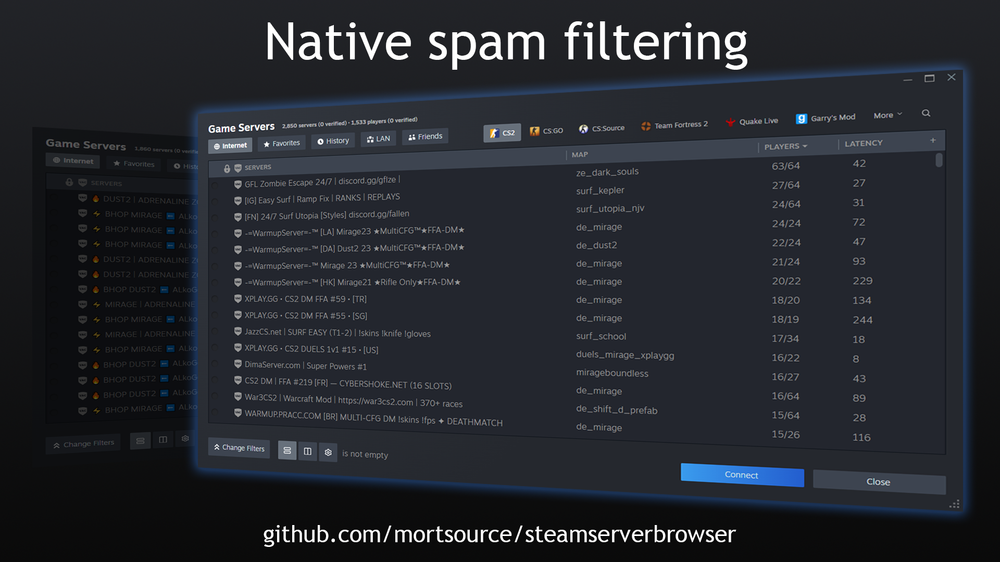

# Server Browser+ for Steam

<p align="center">
    
    
</p>

Server Browser+ is a plugin for the native Steam game server browser. This project requires [Millennium aka SteamBrew](https://steambrew.app), a framework for Steam. It is used commonly for themes but also plugins, install is quick and simple. Report any issues or suggest improvements, this is in active development.

## World Map
  

Splits the native browser into two panes: a virtualized server list with images and a live Leaflet map, synced together. Servers are clustered by region and expand when zoomed. Filters and context menus behave as expected. Quick access tabs for popular games and removed dead games.

## Spam Filtering
  


Individually toggleable filters made to catch different types of master server abuse within the Counter-Strike franchise. Filters sit between the callback to the server browser and add virtually zero overhead by using compiled RegEx patterns, subnet masks and GeoLite MMDB. Our blocklist boasts a **<0.01% false positive rate** across the franchise, the other filters serve mainly as backups.

| Filter | Example |
|---|---|
| **MASTER BLOCKLIST*** | `*.*.*.*/16, /sgaming.ru/i` |
| **CYRILLIC** | `спам-сервер` |
| **PLAYER SPOOFING** | `255/255` | 
| **UNUSUAL PORT**| `x.x.x.x:5000` |
| **EMOJIS** *off by default* | `🏆🏆🏆` | 

*Updated automatically on startup or on-demand in settings

## Install
> [!WARNING]
> If you used the beta of this project, **pureBrowser**, make sure to delete it from your plugins to ensure it doesn't conflict

1. Go to [Millennium (SteamBrew)](https://steambrew.app), download and install.
  

2. Download the latest [release](https://github.com/mortsource/steamserverbrowser/releases/latest) of the plugin, currently it is . Extract the ZIP and paste the contents into your Steam installation likely at ```C:\Program Files (x86)\Steam```.


3. Restart Steam and go to Steam > Millennium in the top bar. Navigate to the 'Plugins' section and enable 'ServerBrowserPlus'. You will be prompted to restart again.


*Slava Ukraini* 🇺🇦