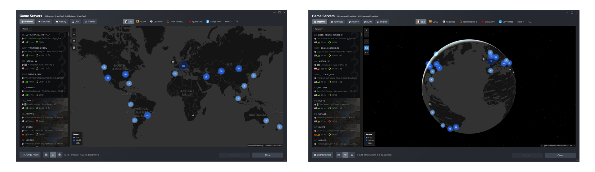
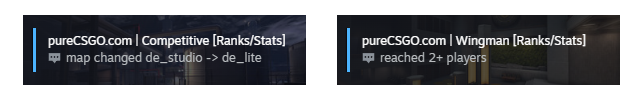
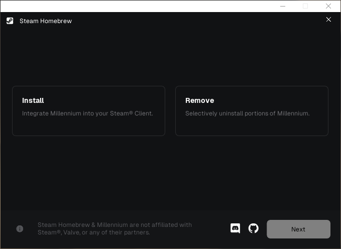
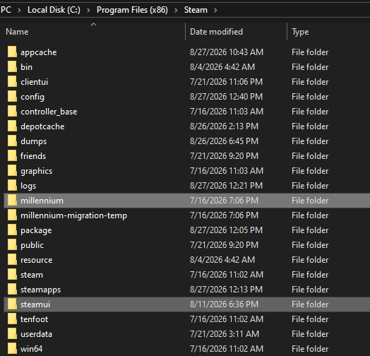
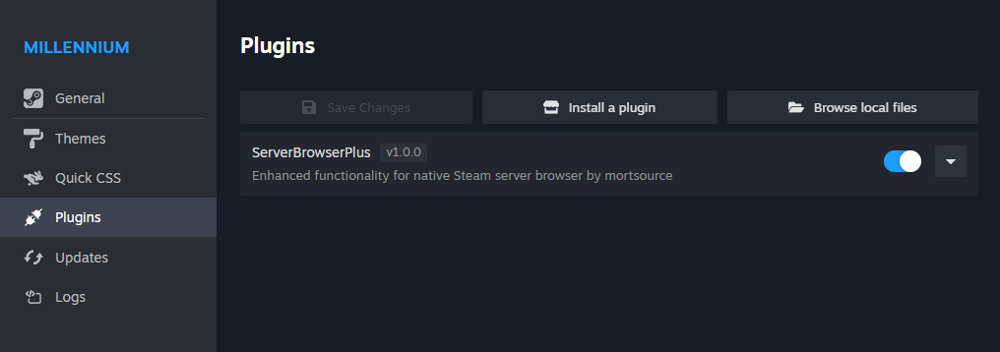

# Server Browser Plus for Steam

    
    
    

**Server Browser Plus** is a plugin for the native Steam server browser. It provides enhanced functionality such as a **world map**, **alert system** and **spam filters**. This project requires [Millennium aka SteamBrew](https://steambrew.app), a framework for Steam. It is commonly used for themes and plugins, installation is quick and simple. This is my first public project and is in active development, so report any issues or suggest improvements.

## World Map  

Injects an alternate view with a world map using MapLibre for 2D/3D and Geolite2 MMDB for IP location. Virtualized list and markers are synced together. Servers are clustered by location and then IP subnet for fine detail. Using the "has users playing/is not empty" filter is recommended.

## Alert System  

Hooks into the native Steam notification toasts to send customizable alerts for favorites. Set an alert within the right-click context menu. Runs A2S favorites query in the background every 60s. Clicking the alert will launch the game, connect and then disable it.

## Spam Filters

Valve has repeatedly ignored issue reports about spam servers flooding the browser for more than 6 years. The spam spans all Counter-Strike games and originates from Russian supernets. Various community members have taken to making entire websites to avoid this. We tackle this issue by implementing configurable filter logic directly into the callback to the server browser.

[#2540](https://github.com/ValveSoftware/csgo-osx-linux/issues/2540) [#2689](https://github.com/ValveSoftware/csgo-osx-linux/issues/2689) [#2735](https://github.com/ValveSoftware/csgo-osx-linux/issues/2735) [#2767](https://github.com/ValveSoftware/csgo-osx-linux/issues/2767) [#3074](https://github.com/ValveSoftware/csgo-osx-linux/issues/3074) [#3093](https://github.com/ValveSoftware/csgo-osx-linux/issues/3093) [#3094](https://github.com/ValveSoftware/csgo-osx-linux/issues/3094) [#3810](https://github.com/ValveSoftware/csgo-osx-linux/issues/3810) [#5101](https://github.com/valvesoftware/source-1-games/issues/5101)  

| Filter | Description |
| --- | --- |
| **Remote Blocklist** | Block known spam networks by IP or RegEx pattern. Maintained by [mort](https://github.com/mortsource) and served from [pureCSGO](https://purecsgo.com). Updated automatically on startup or on-demand in settings¹ |
| **Local Blocklist**  | Block servers locally by either exact IP or /24 subnet with right-click context menu option. Remove blocked servers in the settings menu |
| **Player Spoofing** | Blocks servers over 64 max player count, no Counter-Strike game supports over 64 players |
| **Unusual Port** | Blocks servers outside 26000-30000 port range, most legitimate communities stay within this range |
| **Cyrillic, Chinese, Emoji Hostname**  | Self-explanatory |

¹ SteamID and plugin version are transmitted; they are not shared with third parties.

## Install
1. Go to [Millennium](https://steambrew.app), download and install.  

2. Download the latest [release](https://github.com/mortsource/steamserverbrowser/releases/latest) of the plugin, currently it is . Extract the ZIP and paste the contents into your Steam installation likely at `C:\Program Files (x86)\Steam`.  

3. Restart Steam and go to Steam > Millennium in the top bar. Navigate to the 'Plugins' section and enable 'ServerBrowserPlus'. You will be prompted to restart again.  

*Slava Ukraini* 🇺🇦